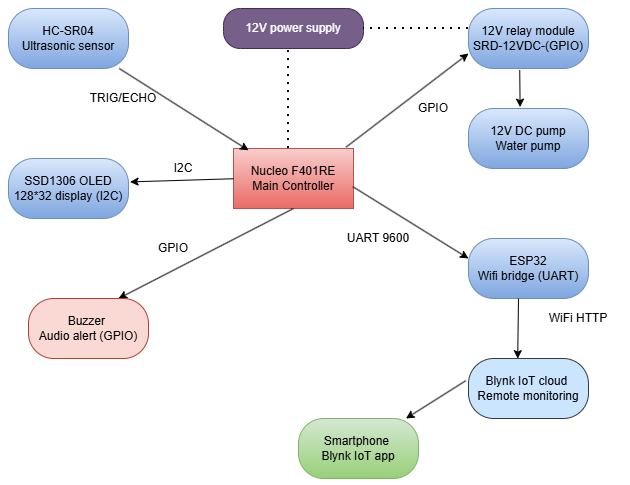
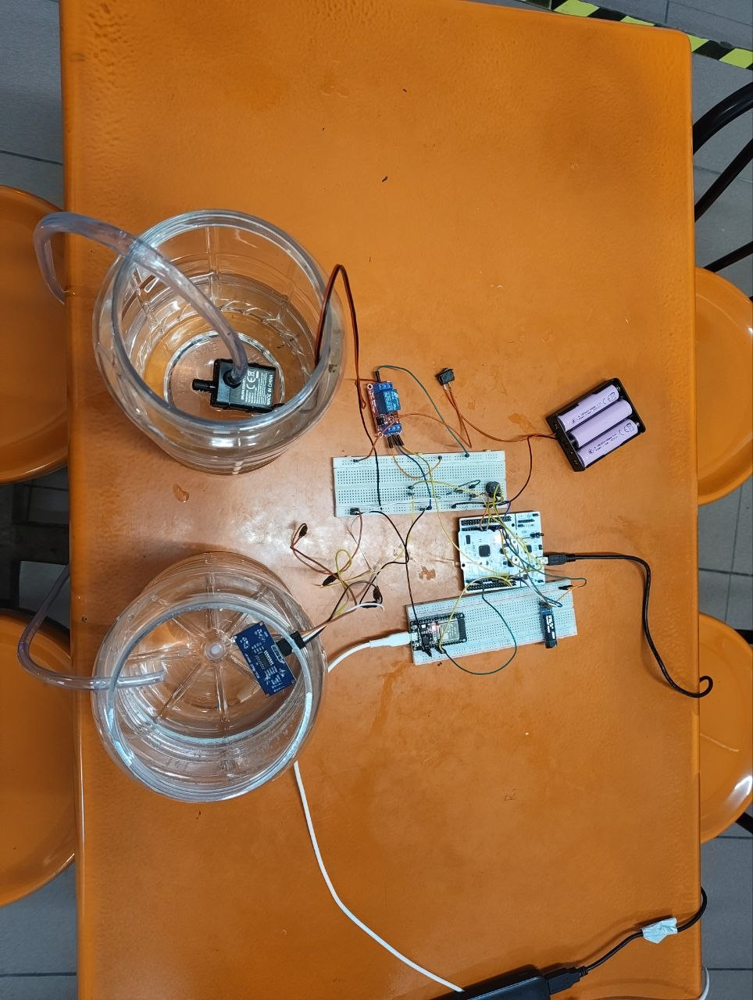
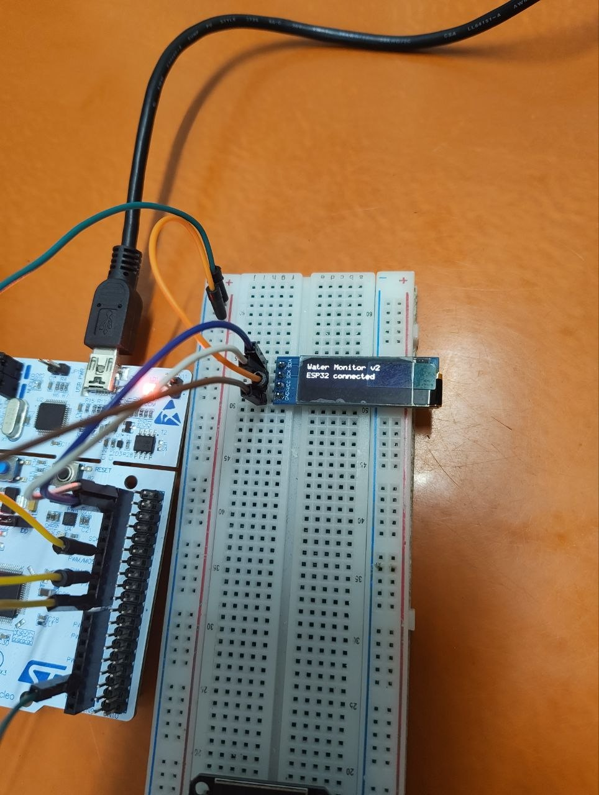
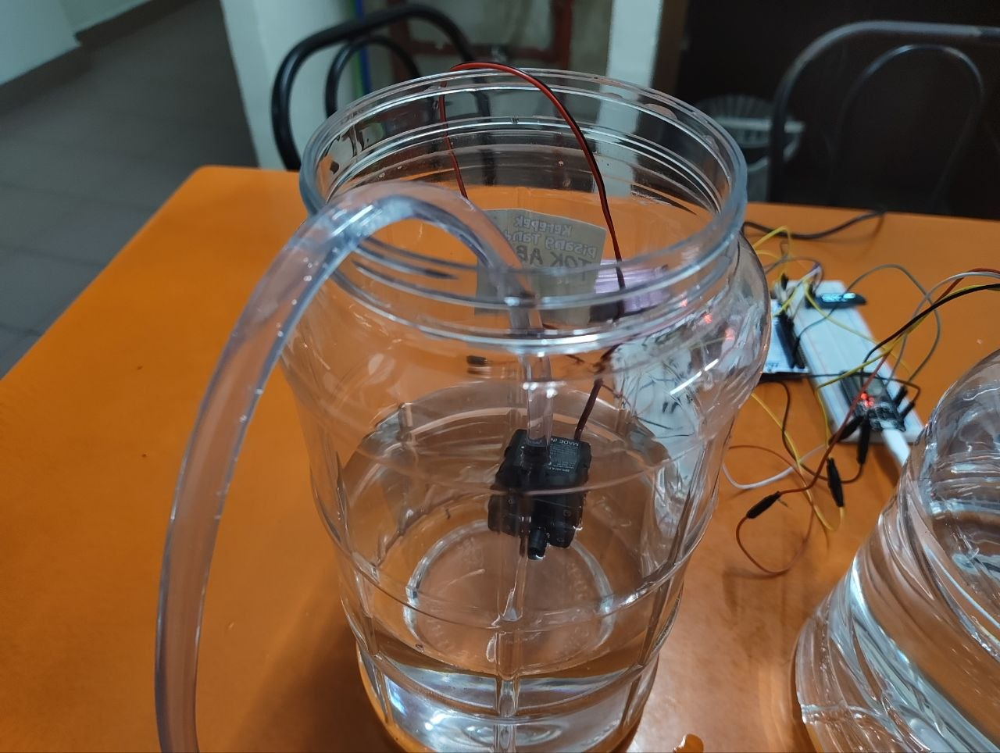
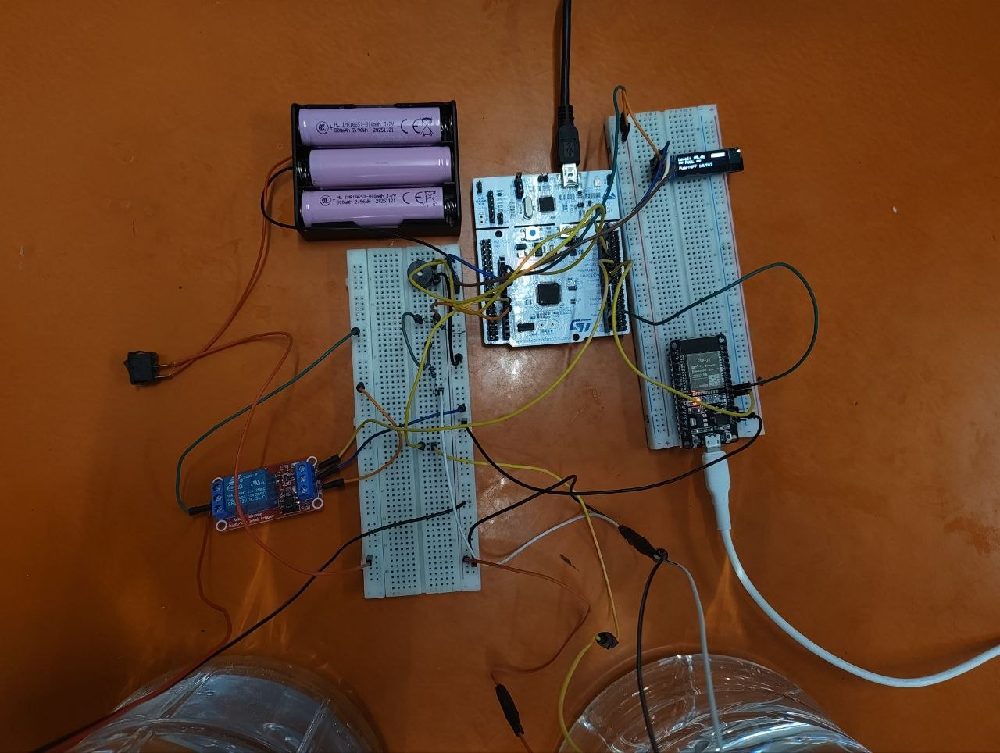
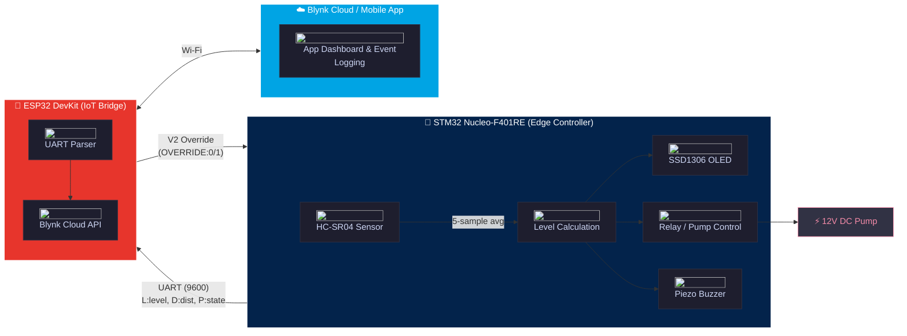

# AbangAir 💧

<p align="center">
  
  
  
  
  
</p>

<p align="center">
  
</p>

---

## 📋 Contents

* [Project Overview](#project-overview)
* [System Architecture](#system-architecture)
* [Features](#features)
* [Installation](#installation)
* [Usage](#usage)
* [Technical Details](#technical-details)
* [Results](#results)
* [Resources](#resources)
* [Contributing](#contributing)
* [License](#license)

---

## Project Overview

An embedded water-tank monitoring and control prototype developed using an **STM32 Nucleo-F401RE** as the real-time controller and an **ESP32 DevKit** as the Wi-Fi/Blynk bridge. The system measures the distance between an HC-SR04 ultrasonic sensor and the water surface, converts the measurement into a calibrated water-level percentage, controls a 12 V pump through a relay module, displays live status on an SSD1306 OLED, produces buzzer alerts, and sends data to the Blynk IoT platform.

Developed as a comprehensive hardware-software portfolio project for **EFB 2073/EEB 2083 – Microprocessors & Computer Architecture** at **Universiti Teknologi PETRONAS** (January 2026 Semester).

> [!WARNING]
> **Hardware:** The HC-SR04 operates at 5V. The ECHO pin *must* be connected to the STM32 through a 5V-to-3.3V voltage divider (e.g., 1kΩ + 2kΩ) to prevent damaging the STM32 GPIO pins.

---

### Hardware Setup

<!-- 
Option 1: Bulletproof HTML Table. 
Standard Markdown parsers often choke on raw HTML  tags inside native Markdown tables. 
Using a pure HTML <table> solves rendering issues on GitHub, GitLab, and local IDEs.
-->
<p align="center">
  
</p>

---

<p align="center">
  <a href="docs/hardware_photos/6235768536831824310_121.jpg" target="_blank">
    
  </a>
</p>

<!-- 
Note on GitHub Behavior:
Wrapping the  in an <a> tag makes it fully clickable. 
When a user clicks it on GitHub, it will naturally open the full-resolution source image 
in a new browser tab ("pop") for close-up technical inspection.
-->

<table align="center" width="100%">
  <tr>
    <td align="center" width="33%">
      <b>Local OLED Interface</b><br>
      
    </td>
    <td align="center" width="33%">
      <b>Submersible Pump</b><br>
      
    </td>
    <td align="center" width="33%">
      <b>Control Circuitry</b><br>
      
    </td>
  </tr>
</table>

---

## Features

- Five-sample ultrasonic distance averaging
- Calibrated water-level calculation
- Automatic relay/pump control
- Sensor-error safety shutdown
- Full and critical-low buzzer alerts
- Direct SSD1306 control using a custom 5×7 font renderer
- UART communication between STM32 and ESP32
- Blynk water-level, pump-state, distance, and Wi-Fi RSSI reporting
- Blynk event logging for low-water and full-tank conditions
- A V2 command that can force the pump relay ON through the implemented override logic

---

## System Architecture

<details open>
<summary><strong>🗺️ System Architecture Diagram</strong></summary>



</details>

---

## Hardware

| Component | Model |
|---|---|
| Main controller | STM32 Nucleo-F401RE |
| IoT bridge | ESP32 DevKit with CP2102 USB interface |
| Distance sensor | HC-SR04 ultrasonic sensor |
| Display | SSD1306 OLED, 128×32, I2C, address 0x3C |
| Relay module | 12 V relay module used to switch the pump |
| Pump | 12 V DC submersible pump |
| Alert device | Piezo buzzer |
| Main load supply | Three 18650 cells in series, approximately 11.1 V nominal and 12.6 V fully charged |

See [`docs/CONNECTIONS.md`](docs/CONNECTIONS.md) for the full wiring table and electrical cautions.

<details>
<summary><strong> Pinout: STM32 Nucleo-F401RE </strong></summary>

| Pin | Function | Notes |
|:---:|:---|:---|
| `PA_0` | HC-SR04 Trigger | 3.3V logic output |
| `PA_1` | HC-SR04 Echo | **Requires 5V→3.3V voltage divider** |
| `PB_9` | OLED SDA | I2C1 |
| `PB_8` | OLED SCL | I2C1 |
| `D4` | OLED Reset | GPIO |
| `PA_6` | Buzzer Output | PWM/Digital |
| `PB_6` | Relay Control | Active HIGH |
| `PA_9` | UART TX | To ESP32 GPIO16 |
| `PA_10`| UART RX | From ESP32 GPIO17 |

</details>

<details>
<summary><strong> Pinout: ESP32 DevKit </strong></summary>


| Pin | Function | Notes |
|:---:|:---|:---|
| `GPIO16` | UART2 RX | From STM32 PA_9 |
| `GPIO17` | UART2 TX | To STM32 PA_10 |
| `GND` | Signal Ground | **Must be shared with STM32** |

</details>

## Firmware Files

### STM32 firmware

```text
stm32_firmware/main.cpp
```

The STM32 firmware:

1. Takes five ultrasonic measurements.
2. Discards readings outside the accepted range.
3. Averages valid samples.
4. Maps distance to water level using:
   - Empty distance: 18.5 cm
   - Full distance: 3.0 cm
5. Activates the pump below 90%.
6. switches the pump off at or above 90%.
7. Forces the relay off when the sensor result is invalid.
8. Produces one 2-second buzzer activation per threshold crossing at:
   - 95% or higher
   - 10% or lower
9. Updates the OLED.
10. Sends a UART record every loop:

```text
L:<level>,D:<distance>,P:<pump_state>
```

### ESP32 firmware

```text
esp32_firmware/esp32_blynk.ino
```

The ESP32 firmware:

1. Receives UART records using `HardwareSerial` UART2.
2. Parses level, distance, and pump state.
3. Sends the latest data to Blynk every two seconds.
4. Writes:
   - V0: water level
   - V1: pump status
   - V3: distance
   - V4: Wi-Fi RSSI
5. Receives a V2 switch value and sends `OVERRIDE:0` or `OVERRIDE:1` to the STM32.
6. Marks STM32 data unavailable after a 10-second UART timeout.
7. Calls the Blynk events `critical_low` and `tank_full` while their conditions are true.


<details>
<summary><strong> Implemented Thresholds </strong></summary>

| Parameter | Code Value |
| :--- | :--- |
| **Empty-tank distance** | `18.5 cm` |
| **Full-tank distance** | `3.0 cm` |
| **Pump ON threshold** | `< 90%` |
| **Pump OFF threshold** | `≥ 90%` |
| **Critical-low alert** | `≤ 10%` (Triggers Buzzer + Blynk Event) |
| **Full alert** | `≥ 95%` (Triggers Buzzer + Blynk Event) |
| **UART Baud Rate** | `9600` |
| **Blynk Update Interval** | `2.0 s` |
| **STM32 timeout on ESP32** | `10 s` |

---

## Blynk Configuration

Create these datastreams:

| Virtual pin | Data | Suggested type/range |
|---|---|---|
| V0 | Water level | Double, 0–100 |
| V1 | Pump state | Integer, 0–1 |
| V2 | Override command | Integer, 0–1 |
| V3 | Distance | Double, 0–400 |
| V4 | Wi-Fi RSSI | Integer, approximately -100 to 0 |

Create the following events:

```text
critical_low
tank_full
```

Detailed setup is available in [`docs/BLYNK_SETUP.md`](docs/BLYNK_SETUP.md).

## Software Setup

### STM32

The supplied `main.cpp` was written for classic ARM Mbed syntax and was developed using Keil Studio Cloud for the NUCLEO-F401RE. Add it to a compatible Mbed project that provides `mbed.h`, select the NUCLEO-F401RE target, build, and flash the board.

### ESP32

1. Install ESP32 board support in Arduino IDE.
2. Install the Blynk library.
3. Open `esp32_firmware/esp32_blynk.ino`.
4. Replace the embedded credentials before use.
5. Select the correct ESP32 board and COM port.
6. Upload the sketch.
7. Open Serial Monitor at 115200 baud.

More detail is provided in [`docs/SOFTWARE_SETUP.md`](docs/SOFTWARE_SETUP.md).

## Testing Summary

The documented test container used:

- Empty distance: 18.5 cm
- Half-level distance: approximately 10.8 cm
- Full distance: approximately 3.0 cm

| Condition | Expected displayed level | Pump | Buzzer |
|---|---:|---|---|
| Empty | 0% | ON | Silent initially unless the low threshold is crossed |
| Half | Approximately 50% | ON | Silent |
| Full | 100% | OFF | 2-second alert |
| Critical low | Approximately 10% | ON | 2-second alert |

The project notes report approximately ±1 cm ultrasonic consistency after five-sample averaging and a Blynk update delay of roughly 2–3 seconds.

## Known Implementation Details

- The STM32 code includes manual-override handling even though the development notes state that the feature was not required in the final demonstration.
- In the implemented STM32 logic, `OVERRIDE:1` forces the relay ON. `OVERRIDE:0` returns control to the automatic threshold logic.
- The ESP32 code can call Blynk event logging repeatedly every two seconds while an alert condition remains true; no event latch is implemented in that sketch.
- The STM32 source retains a global `DigitalOut esp_tx(PA_9)` declaration and also creates `Serial espUart(PA_9, PA_10)` inside `main()`. This repository leaves that source unchanged.
- The relay logic assumes that a logic HIGH activates the selected relay module.
- Common ground is mandatory for UART and relay-control reference levels.

## Repository Structure

```text
Smart-Water-Level-Monitoring-System/
├── README.md
├── LICENSE
├── .gitignore
├── stm32_firmware/
│   └── main.cpp
├── esp32_firmware/
│   └── esp32_blynk.ino
└── docs/
    ├── PROJECT_DEVELOPMENT_NOTES.md
    ├── CONNECTIONS.md
    ├── SOFTWARE_SETUP.md
    ├── BLYNK_SETUP.md
    ├── TESTING_AND_CALIBRATION.md
    ├── TROUBLESHOOTING.md
    ├── FUTURE_IMPROVEMENTS.md
    ├── diagrams
    └── hardware_photos
```

## Skills Demonstrated

- STM32 and ARM Mbed C/C++
- ESP32 programming with Arduino IDE
- Ultrasonic sensing and filtering
- GPIO, I2C, UART, and Wi-Fi integration
- Relay and DC-pump control
- Direct SSD1306 frame-buffer rendering
- Blynk IoT integration
- Embedded-system debugging
- Sensor calibration
- Hardware/software co-design

## Future Improvements

- Add relay hysteresis by separating pump-ON and pump-OFF thresholds
- Add event latching or cooldown for Blynk notifications
- Add a water-flow sensor
- Add redundant level sensing
- Add pump dry-run and overcurrent protection
- Add low-battery monitoring
- Add SMS or cellular fallback
- Add solar charging
- Support multiple tanks
- Move credentials into a private configuration file

## License

Released under the [MIT License](./LICENSE).

---
